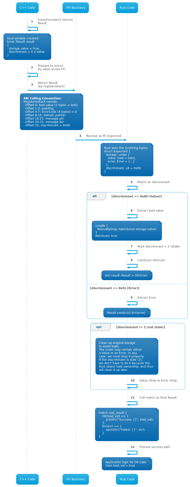

# Result FFI Bindings for Rust

This directory contains Rust FFI bindings that enable seamless interoperability
between C++ and Rust components using BMW's result types.

## Overview

The Rust bindings provide type-safe, zero-cost abstractions for working with:

- **`bmw::Result<T>`** - C++ result type with error handling
- **`bmw::result::Error`** - Error objects with domain and error codes

## Architecture

### Key Components

1. **result.rs** - Core FFI bindings and `Expected<T, E>` type wrapper
   - Provides `ffi::Error` (C++-compatible error representation)
   - Implements conversion logic between C++ and Rust result types

2. **Examples** - Practical demonstrations of FFI usage
   - `result_example.rs` - Basic Result type integration
   - `result_integration_example.rs` - Advanced patterns
   - Other specialized examples

## How the Binding Works

## Calling Sequence

A detailed sequence diagram illustrating the complete FFI flow is available in [sequence.puml](plantuml/sequence.puml), and depicted bellow:



The diagram shows how a C++ function return value crosses the ABI boundary and is converted to a safe Rust type. Key points illustrated:

- **C++ Side**: Creation of `bmw::Result<T>` with discriminant and storage union
- **ABI Layer**: Binary-compatible layout with registers/stack passing
- **Rust Side**: Reception as `result_rs::Result<T>` and pattern matching on discriminant

## Error Handling

### Error Domain Integration

Errors are associated with a domain that provides human-readable messages:

```rust
pub fn display_error(error: &ffi::Error) {
    // domain pointer is valid for the lifetime of error
    unsafe {
        let msg = error.domain.as_ref()
            .expect("Invalid domain pointer")
            .get_message_for_error_code(error.code);
        println!("Error: {}", msg);
    }
}
```

## Building and Testing

### Run Examples

```bash
# Basic Result example
bazel run --config=spp_host_gcc //platform/aas/lib/result/rust:result_rs_example

# SafeResult integration
bazel run --config=spp_host_gcc //platform/aas/lib/result/rust:safe_result_integration_example

# Type mismatch detection
bazel run --config=spp_host_gcc //platform/aas/lib/result/rust:safe_result_type_mismatch_example
```

### Run Tests

```bash
bazel test --config=spp_host_gcc //platform/aas/lib/result/rust:...
```

## Safety Considerations

### Guarantees

- **Binary Compatibility** - Types are `#[repr(C)]` and tested against C++ ABI
- **Memory Safety** - types are owned on the rust side and Result takes care
  of properly cleaning up allocated resources.

## References

- [bmw::Result Documentation](../result.h) - C++ Result type
- [Error Domain Pattern](../error_domain.h) - Error classification system
